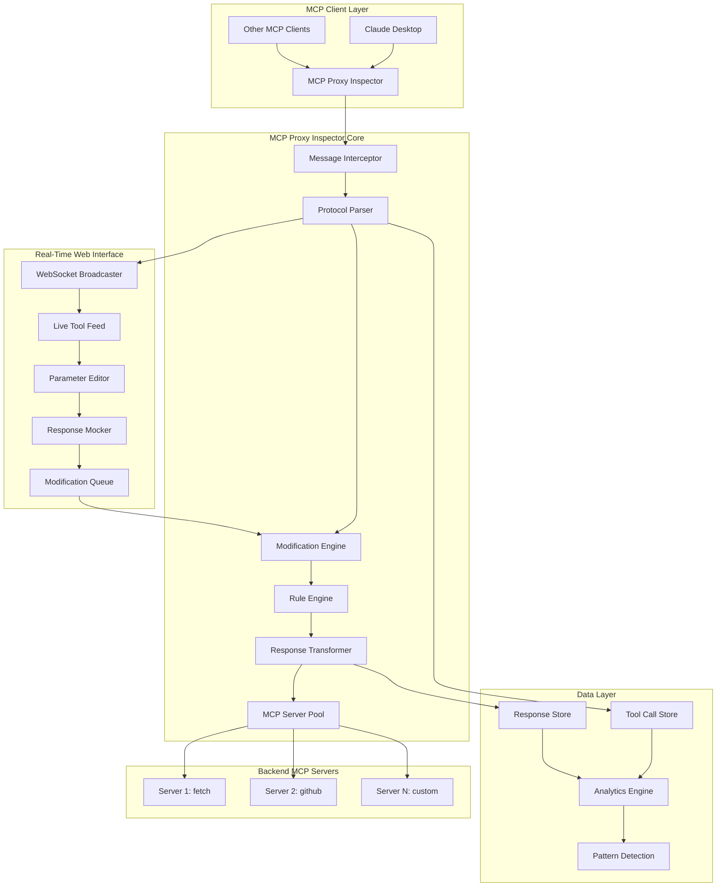

# **MCP DevTools: Real-Time Tool Inspection & Modification Platform**

## **Technical Specification**

### **Architecture Overview**



### **Core Components Implementation**

#### **1. Enhanced MCP Message Interceptor**

```python
# src/mcp_proxy/inspector/interceptor.py
import asyncio
import json
import uuid
from datetime import datetime, timezone
from typing import Any, Dict, Optional, Callable
from dataclasses import dataclass, asdict
from enum import Enum

class MessageType(Enum):
    TOOL_CALL = "tool_call"
    TOOL_RESPONSE = "tool_response"
    RESOURCE_REQUEST = "resource_request"
    RESOURCE_RESPONSE = "resource_response"

@dataclass
class InterceptedMessage:
    id: str
    timestamp: datetime
    message_type: MessageType
    method: Optional[str]
    params: Dict[str, Any]
    raw_message: Dict[str, Any]
    server_name: Optional[str] = None
    client_id: Optional[str] = None
    correlation_id: Optional[str] = None

    def to_dict(self) -> Dict[str, Any]:
        return {
            **asdict(self),
            'timestamp': self.timestamp.isoformat(),
            'message_type': self.message_type.value
        }

class MCPMessageInterceptor:
    def __init__(self, websocket_broadcaster, modification_engine, storage):
        self.websocket_broadcaster = websocket_broadcaster
        self.modification_engine = modification_engine
        self.storage = storage
        self.pending_modifications: Dict[str, asyncio.Event] = {}
        self.active_sessions: Dict[str, Dict] = {}

    async def intercept_request(
        self,
        message: Dict[str, Any],
        server_name: str,
        client_id: str
    ) -> Dict[str, Any]:
        """Intercept and potentially modify outgoing MCP requests."""

        # Parse the MCP message
        intercepted = self._parse_message(message, server_name, client_id)

        # Store original message
        await self.storage.store_message(intercepted)

        # Broadcast to web UI
        await self.websocket_broadcaster.broadcast_tool_call(intercepted)

        # Check for pending modifications
        modified_message = await self._apply_modifications(intercepted, message)

        # Log the final message being sent
        if modified_message != message:
            modified_intercepted = self._parse_message(modified_message, server_name, client_id)
            modified_intercepted.id = f"{intercepted.id}_modified"
            await self.storage.store_message(modified_intercepted)
            await self.websocket_broadcaster.broadcast_modification(
                intercepted.id, modified_intercepted
            )

        return modified_message

    async def intercept_response(
        self,
        response: Dict[str, Any],
        original_request_id: str,
        server_name: str
    ) -> Dict[str, Any]:
        """Intercept and potentially modify MCP responses."""

        # Create response record
        response_record = InterceptedMessage(
            id=f"{original_request_id}_response",
            timestamp=datetime.now(timezone.utc),
            message_type=MessageType.TOOL_RESPONSE,
            method=None,
            params=response,
            raw_message=response,
            server_name=server_name,
            correlation_id=original_request_id
        )

        # Store response
        await self.storage.store_message(response_record)

        # Check for response modifications
        modified_response = await self._apply_response_modifications(
            response_record, response
        )

        # Broadcast to web UI
        await self.websocket_broadcaster.broadcast_tool_response(
            original_request_id, response_record
        )

        return modified_response

    def _parse_message(
        self,
        message: Dict[str, Any],
        server_name: str,
        client_id: str
    ) -> InterceptedMessage:
        """Parse MCP JSON-RPC message into structured format."""

        message_id = str(uuid.uuid4())
        method = message.get('method', '')
        params = message.get('params', {})

        # Determine message type
        if method == 'tools/call':
            msg_type = MessageType.TOOL_CALL
        elif method == 'resources/read':
            msg_type = MessageType.RESOURCE_REQUEST
        else:
            msg_type = MessageType.TOOL_CALL  # Default

        return InterceptedMessage(
            id=message_id,
            timestamp=datetime.now(timezone.utc),
            message_type=msg_type,
            method=method,
            params=params,
            raw_message=message,
            server_name=server_name,
            client_id=client_id
        )

    async def _apply_modifications(
        self,
        intercepted: InterceptedMessage,
        original_message: Dict[str, Any]
    ) -> Dict[str, Any]:
        """Apply any pending modifications to the message."""

        # Check if there's a pending modification for this message
        modification = await self.modification_engine.get_pending_modification(
            intercepted.id
        )

        if modification:
            # Apply the modification
            modified_message = self.modification_engine.apply_modification(
                original_message, modification
            )
            return modified_message

        # Check for rule-based modifications
        rule_modification = await self.modification_engine.apply_rules(
            intercepted, original_message
        )

        return rule_modification or original_message

    async def _apply_response_modifications(
        self,
        response_record: InterceptedMessage,
        original_response: Dict[str, Any]
    ) -> Dict[str, Any]:
        """Apply modifications to responses."""

        modification = await self.modification_engine.get_response_modification(
            response_record.correlation_id
        )

        if modification:
            return self.modification_engine.apply_response_modification(
                original_response, modification
            )

        return original_response
```

#### **2. Real-Time Modification Engine**

```python
# src/mcp_proxy/inspector/modifier.py
import asyncio
import json
from typing import Any, Dict, Optional, List, Callable
from dataclasses import dataclass
from enum import Enum

class ModificationType(Enum):
    PARAMETER_CHANGE = "parameter_change"
    PARAMETER_ADD = "parameter_add"
    PARAMETER_REMOVE = "parameter_remove"
    MOCK_RESPONSE = "mock_response"
    BLOCK_REQUEST = "block_request"
    ROUTE_TO_SERVER = "route_to_server"

@dataclass
class Modification:
    id: str
    message_id: str
    modification_type: ModificationType
    changes: Dict[str, Any]
    created_at: str
    applied: bool = False

class ModificationEngine:
    def __init__(self):
        self.pending_modifications: Dict[str, Modification] = {}
        self.response_modifications: Dict[str, Modification] = {}
        self.modification_rules: List[ModificationRule] = []
        self.paused_messages: Dict[str, asyncio.Event] = {}

    async def pause_message(self, message_id: str) -> None:
        """Pause a message for manual modification."""
        if message_id not in self.paused_messages:
            self.paused_messages[message_id] = asyncio.Event()

    async def resume_message(self, message_id: str, modification: Optional[Modification] = None) -> None:
        """Resume a paused message with optional modifications."""
        if modification:
            self.pending_modifications[message_id] = modification

        if message_id in self.paused_messages:
            self.paused_messages[message_id].set()

    async def get_pending_modification(self, message_id: str) -> Optional[Modification]:
        """Get pending modification for a message."""

        # Check if message is paused
        if message_id in self.paused_messages:
            await self.paused_messages[message_id].wait()
            # Clean up the event
            del self.paused_messages[message_id]

        return self.pending_modifications.pop(message_id, None)

    def apply_modification(
        self,
        original_message: Dict[str, Any],
        modification: Modification
    ) -> Dict[str, Any]:
        """Apply a modification to a message."""

        modified_message = json.loads(json.dumps(original_message))  # Deep copy

        if modification.modification_type == ModificationType.PARAMETER_CHANGE:
            self._apply_parameter_changes(modified_message, modification.changes)
        elif modification.modification_type == ModificationType.PARAMETER_ADD:
            self._add_parameters(modified_message, modification.changes)
        elif modification.modification_type == ModificationType.PARAMETER_REMOVE:
            self._remove_parameters(modified_message, modification.changes)
        elif modification.modification_type == ModificationType.BLOCK_REQUEST:
            # Return a blocked request indicator
            return {"blocked": True, "reason": modification.changes.get("reason", "Blocked by user")}

        return modified_message

    def _apply_parameter_changes(self, message: Dict[str, Any], changes: Dict[str, Any]) -> None:
        """Apply parameter changes to message."""
        params = message.get('params', {})

        for path, new_value in changes.items():
            self._set_nested_value(params, path, new_value)

    def _add_parameters(self, message: Dict[str, Any], additions: Dict[str, Any]) -> None:
        """Add new parameters to message."""
        if 'params' not in message:
            message['params'] = {}

        for path, value in additions.items():
            self._set_nested_value(message['params'], path, value)

    def _remove_parameters(self, message: Dict[str, Any], removals: List[str]) -> None:
        """Remove parameters from message."""
        params = message.get('params', {})

        for path in removals:
            self._remove_nested_value(params, path)

    def _set_nested_value(self, obj: Dict[str, Any], path: str, value: Any) -> None:
        """Set a nested value using dot notation path."""
        keys = path.split('.')
        current = obj

        for key in keys[:-1]:
            if key not in current:
                current[key] = {}
            current = current[key]

        current[keys[-1]] = value

    def _remove_nested_value(self, obj: Dict[str, Any], path: str) -> None:
        """Remove a nested value using dot notation path."""
        keys = path.split('.')
        current = obj

        for key in keys[:-1]:
            if key not in current:
                return
            current = current[key]

        if keys[-1] in current:
            del current[keys[-1]]

@dataclass
class ModificationRule:
    """Rule-based automatic modifications."""
    name: str
    condition: Callable[[InterceptedMessage], bool]
    modification: Modification
    enabled: bool = True
```

#### **3. Real-Time WebSocket Interface**

```python
# src/mcp_proxy/inspector/websocket.py
import asyncio
import json
from typing import Set, Dict, Any
from fastapi import WebSocket, WebSocketDisconnect
import logging

logger = logging.getLogger(__name__)

class WebSocketBroadcaster:
    def __init__(self):
        self.active_connections: Set[WebSocket] = set()
        self.client_subscriptions: Dict[WebSocket, Set[str]] = {}

    async def connect(self, websocket: WebSocket, client_id: str = None):
        """Connect a new WebSocket client."""
        await websocket.accept()
        self.active_connections.add(websocket)
        self.client_subscriptions[websocket] = set()

        # Send initial connection confirmation
        await websocket.send_json({
            "type": "connection_established",
            "client_id": client_id,
            "timestamp": datetime.now(timezone.utc).isoformat()
        })

        logger.info(f"WebSocket client connected: {client_id}")

    def disconnect(self, websocket: WebSocket):
        """Disconnect a WebSocket client."""
        self.active_connections.discard(websocket)
        self.client_subscriptions.pop(websocket, None)
        logger.info("WebSocket client disconnected")

    async def broadcast_tool_call(self, intercepted_message: InterceptedMessage):
        """Broadcast a tool call to all connected clients."""
        message = {
            "type": "tool_call",
            "data": intercepted_message.to_dict()
        }
        await self._broadcast_to_all(message)

    async def broadcast_tool_response(self, request_id: str, response: InterceptedMessage):
        """Broadcast a tool response to all connected clients."""
        message = {
            "type": "tool_response",
            "request_id": request_id,
            "data": response.to_dict()
        }
        await self._broadcast_to_all(message)

    async def broadcast_modification(self, original_id: str, modified_message: InterceptedMessage):
        """Broadcast a modification event."""
        message = {
            "type": "modification_applied",
            "original_id": original_id,
            "modified_data": modified_message.to_dict()
        }
        await self._broadcast_to_all(message)

    async def broadcast_pause_request(self, message_id: str, intercepted_message: InterceptedMessage):
        """Broadcast a pause request for manual modification."""
        message = {
            "type": "pause_request",
            "message_id": message_id,
            "data": intercepted_message.to_dict(),
            "requires_action": True
        }
        await self._broadcast_to_all(message)

    async def handle_client_message(self, websocket: WebSocket, message: Dict[str, Any]):
        """Handle incoming messages from WebSocket clients."""
        message_type = message.get("type")

        if message_type == "modify_message":
            await self._handle_modification_request(message)
        elif message_type == "resume_message":
            await self._handle_resume_request(message)
        elif message_type == "pause_message":
            await self._handle_pause_request(message)
        elif message_type == "subscribe":
            await self._handle_subscription(websocket, message)

    async def _handle_modification_request(self, message: Dict[str, Any]):
        """Handle a modification request from the web UI."""
        message_id = message.get("message_id")
        changes = message.get("changes", {})
        modification_type = message.get("modification_type", "parameter_change")

        modification = Modification(
            id=str(uuid.uuid4()),
            message_id=message_id,
            modification_type=ModificationType(modification_type),
            changes=changes,
            created_at=datetime.now(timezone.utc).isoformat()
        )

        # This would be injected from the main application
        await self.modification_engine.resume_message(message_id, modification)

    async def _broadcast_to_all(self, message: Dict[str, Any]):
        """Broadcast a message to all connected clients."""
        if not self.active_connections:
            return

        disconnected = set()
        for websocket in self.active_connections:
            try:
                await websocket.send_json(message)
            except WebSocketDisconnect:
                disconnected.add(websocket)
            except Exception as e:
                logger.error(f"Error broadcasting to WebSocket: {e}")
                disconnected.add(websocket)

        # Clean up disconnected clients
        for websocket in disconnected:
            self.disconnect(websocket)
```

#### **4. Enhanced Proxy Server Integration**

```python
# src/mcp_proxy/inspector/proxy_integration.py
from mcp.server import Server
from mcp.types import JSONRPCMessage
from typing import Any, Dict

class InspectorProxyServer(Server):
    """Enhanced MCP Server with inspection capabilities."""

    def __init__(self, original_session, interceptor: MCPMessageInterceptor):
        super().__init__("mcp-proxy-inspector")
        self.original_session = original_session
        self.interceptor = interceptor
        self.server_name = "default"

    async def handle_request(self, request: JSONRPCMessage) -> JSONRPCMessage:
        """Override request handling to add inspection."""

        # Convert to dict for easier manipulation
        request_dict = request.model_dump() if hasattr(request, 'model_dump') else dict(request)

        # Intercept the request
        modified_request_dict = await self.interceptor.intercept_request(
            request_dict,
            self.server_name,
            "web_client"  # Could be dynamic
        )

        # Check if request was blocked
        if modified_request_dict.get("blocked"):
            # Return a blocked response
            return JSONRPCMessage(
                jsonrpc="2.0",
                id=request_dict.get("id"),
                error={
                    "code": -32000,
                    "message": modified_request_dict.get("reason", "Request blocked")
                }
            )

        # Convert back to JSONRPCMessage
        modified_request = JSONRPCMessage(**modified_request_dict)

        # Forward to original session
        response = await self.original_session.send_request(modified_request)

        # Convert response to dict
        response_dict = response.model_dump() if hasattr(response, 'model_dump') else dict(response)

        # Intercept the response
        modified_response_dict = await self.interceptor.intercept_response(
            response_dict,
            request_dict.get("id", "unknown"),
            self.server_name
        )

        # Convert back to JSONRPCMessage
        return JSONRPCMessage(**modified_response_dict)
```

#### **5. Web Interface Backend**

```python
# src/mcp_proxy/web/app.py
from fastapi import FastAPI, WebSocket, WebSocketDisconnect, Request
from fastapi.staticfiles import StaticFiles
from fastapi.templating import Jinja2Templates
from fastapi.responses import HTMLResponse
import json
from typing import Dict, Any

app = FastAPI(title="MCP DevTools", description="Real-time MCP inspection and modification")

# Mount static files and templates
app.mount("/static", StaticFiles(directory="src/mcp_proxy/web/static"), name="static")
templates = Jinja2Templates(directory="src/mcp_proxy/web/templates")

# Global instances (would be properly injected in real implementation)
websocket_broadcaster = WebSocketBroadcaster()
modification_engine = ModificationEngine()

@app.get("/", response_class=HTMLResponse)
async def dashboard(request: Request):
    """Main dashboard page."""
    return templates.TemplateResponse("dashboard.html", {"request": request})

@app.websocket("/ws")
async def websocket_endpoint(websocket: WebSocket):
    """WebSocket endpoint for real-time communication."""
    await websocket_broadcaster.connect(websocket)
    try:
        while True:
            data = await websocket.receive_text()
            message = json.loads(data)
            await websocket_broadcaster.handle_client_message(websocket, message)
    except WebSocketDisconnect:
        websocket_broadcaster.disconnect(websocket)

@app.get("/api/messages/history")
async def get_message_history(limit: int = 100):
    """Get recent message history."""
    # This would query the storage backend
    return {"messages": [], "total": 0}

@app.post("/api/messages/{message_id}/pause")
async def pause_message(message_id: str):
    """Pause a message for modification."""
    await modification_engine.pause_message(message_id)
    return {"status": "paused", "message_id": message_id}

@app.post("/api/messages/{message_id}/modify")
async def modify_message(message_id: str, modification_data: Dict[str, Any]):
    """Apply modifications to a paused message."""
    modification = Modification(
        id=str(uuid.uuid4()),
        message_id=message_id,
        modification_type=ModificationType(modification_data["type"]),
        changes=modification_data["changes"],
        created_at=datetime.now(timezone.utc).isoformat()
    )

    await modification_engine.resume_message(message_id, modification)
    return {"status": "modified", "modification_id": modification.id}

@app.get("/api/servers")
async def list_servers():
    """List all available MCP servers."""
    # This would return the current server configuration
    return {"servers": []}

@app.get("/api/analytics/tools")
async def tool_analytics():
    """Get tool usage analytics."""
    return {
        "most_used_tools": [],
        "error_rates": {},
        "performance_metrics": {}
    }
```

### **Implementation Phases**

#### **Phase 1: Core Interception (Weeks 1-2)**
- Message interceptor with basic parsing
- WebSocket real-time broadcasting
- Simple web UI for viewing tool calls
- Basic message storage

#### **Phase 2: Modification Engine (Weeks 3-4)**
- Pause/resume functionality
- Parameter modification interface
- Response mocking capabilities
- Rule-based modifications

#### **Phase 3: Advanced Features (Weeks 5-6)**
- Analytics and pattern detection
- Advanced filtering and search
- Export/import of modification rules
- Performance optimization

#### **Phase 4: Production Features (Weeks 7-8)**
- Authentication and authorization
- Multi-user support
- Configuration management
- Docker compose deployment

### **Key Benefits**

1. **Real-Time Debugging**: See MCP tool calls as they happen
2. **Interactive Modification**: Edit parameters on-the-fly
3. **Response Mocking**: Test different scenarios without backend changes
4. **Pattern Analysis**: Understand tool usage patterns
5. **Security Auditing**: Monitor and control sensitive operations
6. **Development Acceleration**: Rapid prototyping and testing

### **Technical Requirements**

#### **Dependencies**
```toml
dependencies = [
    "mcp>=1.8.0,<2.0.0",
    "uvicorn>=0.34.0",
    "fastapi>=0.104.0",
    "websockets>=12.0",
    "jinja2>=3.1.0",
    "python-multipart>=0.0.6",
    "structlog>=23.0.0",
    "redis>=5.0.0",  # For message queuing
]
```

#### **Docker Compose Configuration**
```yaml
services:
  mcp-devtools:
    build: .
    ports:
      - "8080:8080"  # MCP proxy
      - "3000:3000"  # Web UI
    environment:
      - ENABLE_INSPECTOR=true
      - REDIS_URL=redis://redis:6379
    depends_on:
      - redis

  redis:
    image: redis:alpine
    ports:
      - "6379:6379"
```

This specification provides a comprehensive foundation for building a real-time MCP tool inspection and modification platform that transforms your proxy into a powerful debugging and development tool for the MCP ecosystem.